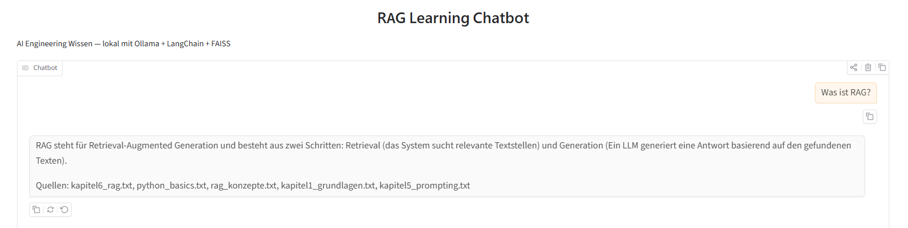

# RAG Learning Chatbot

Local AI-powered Q&A chatbot for studying AI Engineering. Uses Retrieval-Augmented Generation (RAG) to answer questions based on your own knowledge base.



## Features

- Local LLM via Ollama (Gemma3 4B) - no API costs, full privacy
- Dedicated embedding model (nomic-embed-text-v2-moe) for better retrieval quality
- RAG with FAISS vector search (k=6 retrieval)
- Knowledge base as simple text files in `wissen/` folder
- Built-in commands: help, status, neues wissen, exit
- Anti-hallucination prompt - answers only from provided context
- Source attribution for every answer
- **Web interface** via Gradio (`python gradio_app.py` → open localhost:7860)

## Architecture

User Question → FAISS Retriever (k=6) → Context + Prompt → Ollama LLM → Answer + Sources

## Tech Stack

- Python 3
- Ollama + Gemma3 4B (local LLM)
- Ollama + nomic-embed-text-v2-moe (multilingual embeddings, ~100 languages)
- LangChain (document loading, text splitting, retrieval)
- FAISS (vector similarity search)

## Setup

1. Install Ollama: https://ollama.com
2. Pull the models: `ollama pull gemma3:4b` and `ollama pull nomic-embed-text-v2-moe`
3. Install dependencies: `pip install -r requirements.txt`
4. Run: `python rag_chatbot.py`

## Adding Knowledge

1. Add `.txt` files to the `wissen/` folder
2. Run the chatbot and type `neues wissen` to rebuild the index

## Web Interface

```bash
python gradio_app.py
```

Opens a browser-based chat UI at `http://localhost:7860`.
Requires Ollama running and FAISS index built.

## Current Knowledge Base

- AI Engineering fundamentals (Chip Huyen Ch.1)
- Prompt Engineering (Ch.5)
- RAG concepts (Ch.6)
- Python basics
- RAG architecture concepts

## License

GPL-3.0 - see [LICENSE](LICENSE)
